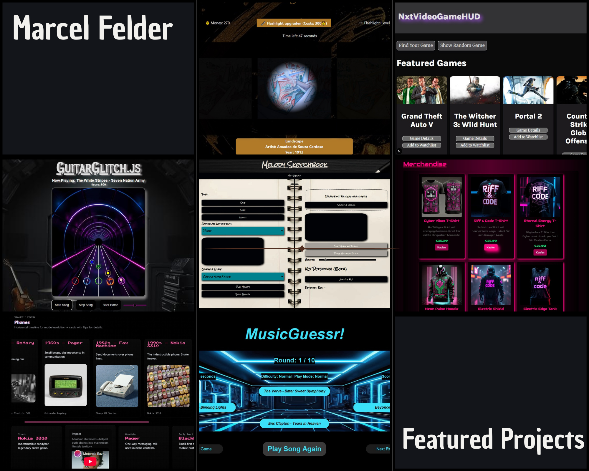

  

# Hi, I'm Marcel 👋  
Frontend Developer in the making, passionate about interactive web projects and creative solutions.  
I recently completed a Frontend Developer training at Cimdata and am currently exploring React, Next.js, TypeScript, JavaScript, HTML and CSS. Always learning, always building!

## 🚀 Featured Projects

- [Aufmischen Portfolio Engine](https://github.com/MarcelFelder-git/next-aufmischen_portfolio_v02) 🏗️ Modern headless portfolio engine built with Next.js and Sanity CMS. Developed to production readiness as a client project, now hosted as a fully functional open-source showcase due to client-side launch cancellation.
- [Art Robbery: The Heist](https://github.com/MarcelFelder-git/01_art_robbery) 🎨 Interactive museum heist game with API (React, JavaScript)
- [NxtVideoGameHUD](https://github.com/MarcelFelder-git/02_nxt_videogame_hud) 🎮 Game finder & API dashboard (Next.js, React, TypeScript)
- [Guitar Glitch](https://github.com/MarcelFelder-git/03_guitar_glitch) 🎸 Browser-based rhythm game (JavaScript, HTML, CSS)
- [Melody Sketchbook](https://github.com/MarcelFelder-git/04_melody_sketchbook) 🎵 Draw & play melodies in browser (JavaScript, HTML, CSS)  
- [Riff & Code Festival](https://github.com/MarcelFelder-git/05_riff_and_code_festival) 🏟️ Multi-page music festival website (HTML, CSS)  
- [Modern Museum of Lost Technology](https://github.com/MarcelFelder-git/06_museum_of_lost_technology) 🏛️ Single-page interactive museum (HTML, CSS)
- [Music Guessr](https://github.com/MarcelFelder-git/07_music_guessr) 🎶 Python music quiz game with Tkinter frontend (Python)

  

## 🛠 Technologies & Skills
React ⚛️ | Next.js 🚀 | TypeScript 📝 | JavaScript 💻 | HTML 🏷️ | CSS 🎨 | Python 🐍

## 📫 Contact Me
marcel.felder.bln@gmail.com
